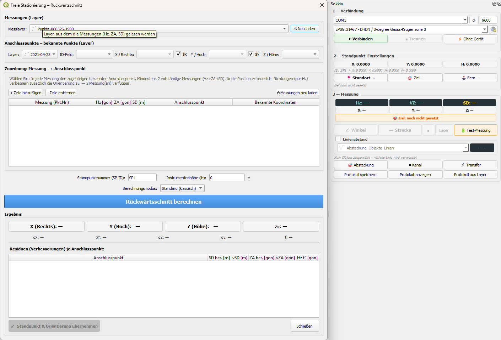

# QGIS Sokkia Plugin

QGIS-Plugin zur Verbindung eines Sokkia-Tachymeters (SDR33-Protokoll) mit QGIS 3.x.

**Autor:** Manuel Hart · mh@geokoord.com · [geokoord.com](https://geokoord.com)  
**Repository:** https://github.com/geopackix/qgis_sokkia  
**Kompatibilität:** QGIS 3.0 und höher (getestet mit QGIS 3.42 Münster, Python 3.12)

---

## Übersicht

Das Plugin verbindet einen Sokkia-Tachymeter über eine serielle Schnittstelle mit QGIS.
Messwerte (Hz, ZA, Schrägdistanz) werden automatisch empfangen, als 3D-Koordinaten
berechnet und in einem Vektor-Layer gespeichert. Alle Funktionen sind über ein
angedocktes Panel (Dock Widget) erreichbar.

# UI

---

## Funktionen

### 1. Verbindung & Kommunikation

- **Verbinden / Trennen:** Serielle Verbindung zum Tachymeter herstellen oder trennen.
  COM-Port und Baudrate sind frei wählbar. Automatische Port-Erkennung über „Ports neu laden".
- **Initialisieren:** Tachymeter zurücksetzen und Kommunikation initialisieren.
- **Laser-Toggle:** Distanzmess-Laser des Instruments ein-/ausschalten.

### 2. Stationierung (Standpunkt setzen)

- **Standort-Dialog:** Manuelles Setzen des Standpunkts (ID, X/Y/Z, Instrumentenhöhe,
  optionaler Anschlusspunkt für die Orientierung). Standpunkt und Orientierung werden
  im Mess-Layer gespeichert und in QGIS zentriert.
- **Freie Stationierung (Rückwärtsschnitt):** Automatische Berechnung des Standpunkts
  aus Messungen auf bekannte Anschlusspunkte (Festpunkte).
  - Wahl des Messlayers und des Anschlusspunkt-Layers (beliebiger QGIS-Vektor-Layer)
  - Automatische Zuordnung von Messungen zu Anschlusspunkten anhand der Punktnummer
  - Unterstützt **vollständige Messungen** (Hz + ZA + SD) für die Positionsberechnung
    sowie **reine Richtungsmessungen** (nur Hz) zur Verbesserung der Orientierung z₀
  - Messungen mit SD = 0 oder NULL werden automatisch als Richtungsmessungen erkannt
  - **Zwei Berechnungsmodi:**
    - *Standard (klassisch):* Iterativer Rückwärtsschnitt mit Höhenwinkel-Modell
    - *Erweitert (konform):* Vollständiger Ausgleich mit Instrumenten-/Reflektorhöhe,
      Refraktion, Erdkrümmung, A-priori-Sigmen je Beobachtungstyp, optionaler Schätzung
      von Maßstab und Additionskonstante für Strecken
  - **Qualitätsbewertung** des Ergebnisses: Ausgezeichnet / Gut / Akzeptabel / Schlecht
    (konfigurierbar über `resection/resection_quality.json`)
  - Farbige Darstellung aller Kenngrößen (σ, RMS, max. Residuum, Redundanz)
  - Residualtabelle mit Warnung (orange) und Fehler (rot) je Anschlusspunkt
  - **JAG3D-Export:** Automatischer Export aller Beobachtungen im offiziellen
    JAG3D ASCII-Format (separate Dateien für Festpunkte, Neupunkte, Schrägstrecken,
    Richtungen, Zenitwinkel) mit vollständiger Import-Anleitung als README.txt

### 3. Zielpunkt-Dialog

- Eingabe und Verwaltung der aktuellen Zielpunkt-Konfiguration:
  ID-Prefix, Punkttyp (aus konfigurierbarer `pointTypes.json`), Reflektorhöhe (th).
- Automatische Nummerierung mit konfigurierbarem Prefix pro Punkttyp.

### 4. Messen

- **Einzelmessung:** Misst genau einen Punkt auf Befehl.
- **Fortlaufendes Messen:** Kontinuierliche Messung; automatisches Speichern jedes
  empfangenen Messwerts im Layer.
- **Messung stoppen:** Beendet die fortlaufende Messung.
- Gemessene Punkte werden als 3D-Koordinaten (X, Y, Z) berechnet und in QGIS
  als Punkt-Feature gespeichert (Punktnummer, Typ, Recordtime, ih, th,
  Schrägdistanz, Horizontalwinkel, Zenitwinkel, Distanz, orientierter Hz).
- Visualisierung der aktuellen Messrichtung als Richtungspfeil auf der Karte.

### 5. Testmessung

- Simulation einer Messung mit frei wählbaren Hz, ZA, SD und Zielhöhe –
  ohne physische Verbindung zum Tachymeter.

### 6. Fernsteuerung

- Direkteingabe von SDR33-Befehlen: manuelle Horizontal- und Vertikalwinkel-Vorgabe
  (Hz / ZA), Auslösung von Messungen, Laser etc.

### 7. Absteckung

- Auswahl eines Zielpunkt-Layers und eines Punktes aus der ComboBox.
- Berechnung und Anzeige von:
  - Geodätischem Richtungswinkel (t°) zum Zielpunkt
  - Instrumentenablesung (Hz-Rohwert) unter Berücksichtigung der aktuellen Orientierung
  - Horizontaldistanz (HD) und Zenitwinkel (ZA, 2D oder 3D)
- Direktes Anfahren: Sendet `*DHA…VA…`-Befehl an den Tachymeter.
- Modi: 2D (nur Hz) oder 3D (Hz + ZA), Höhe aus Geometrie oder Attributfeld.

### 8. Kanalmessstab

- Messung von Schacht-Sohlpunkten mit einem Stab mit zwei Prismen.
- Workflow: Nacheinander Messung von Prisma 1 (oben) und Prisma 2 (unten).
  Der Zielpunkt T wird in Verlängerung des Stabvektors berechnet.
- Visualisierung des Stabs als Linienfeature (RubberBand und Layer).
- Hilfsmesspunkte werden in eigenem Layer „HilfsMesspunkte" gespeichert.

### 9. Koordinaten-Transfer

- **Upload (Layer → Tachymeter):** Koordinaten aus einem QGIS-Layer werden
  im SDR33-Format seriell an den Tachymeter übertragen.
- **Download (Datei → Layer):** SDR33-Dateien einlesen und als QGIS-Layer importieren.
- **Serieller Download:** Direktempfang von SDR33-Koordinaten vom Gerät.

### 10. Protokoll

- Automatische Protokollierung aller Messungen, Stationierungen und Ereignisse
  als JSON (Autosave in `temp_protocols/`).
- **Protokoll exportieren:** Speichern des aktuellen Protokolls als Textdatei.
- **Protokoll anzeigen:** Übersicht aller protokollierten Ereignisse im Dialog.
- **Protokoll aus Layer laden:** Rekonstruktion des Protokolls aus einem vorhandenen
  Mess-Layer.

---

## Winkel-Konventionen

- Alle Orientierungen und Horizontalwinkel werden intern auf **[0, 400) gon** normiert.
- 400 gon = Vollkreis (Gon-Kreiseinteilung).
- Hz = 0 gon entspricht Nord (Rechtswert-Richtung), Hz = 100 gon = Ost, usw.

---

## Konfiguration

| Datei | Zweck |
|---|---|
| `pointTypes.json` | Punkttypen mit Prefix und Beschreibung |
| `resectionConfig.json` | A-priori-Standardabweichungen für den Ausgleich |
| `resection/resection_quality.json` | Schwellwerte für die Qualitätsbewertung |

---

## Abhängigkeiten

- QGIS 3.x (PyQt5, qgis.core, qgis.gui)
- Python-Pakete: `numpy`, `pyserial`

---

## Lizenz

MIT
